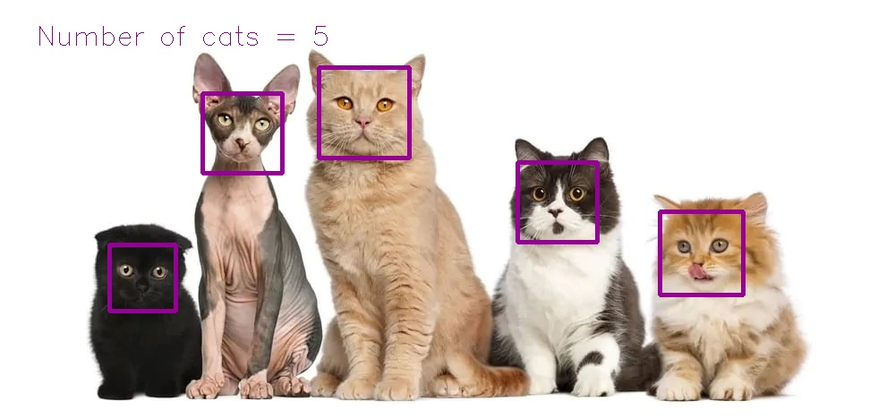

# Assignment28 : Face Detectoe

## How to Install
Run following command :
```
pip install -r requirments.txt
```
## First section in this assignment
You will see a Football Pitch by running this code
execute this command in terminal to Run this code :
```
1.py
```
result of this code :

## Second section in this assignment
This code is a Cat Detector, it will detect cats and draw a rectangle around their face
execute this command in terminal to Run this code :
```
2.py
```
result of this code :


## Third section in this assignment